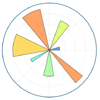

- 🏢 I'm currently working as a Software Engineer at Dell Technologies.
- 🎓 I have completed post graduation studies in Information Technology.
- 📚 I’m currently learning virtualization.
- ✨ I love 
  - reading crime, thriller, mystries, psychology and self-help books 📖, we can talk about books [https://www.goodreads.com/](https://www.goodreads.com/user/show/69916457-omkar-patil)
  - playing chess ♟️, you can connect with me on [Chess.com](https://www.chess.com/member/phileinsophos)

# Tools and technologies I have worked with
- 
  
  
 
- 
  
  
 
- 
  
  
  
  
  
  
  
  
  
 
- 
  
 
- 
  
 
- 
  
 
- 
